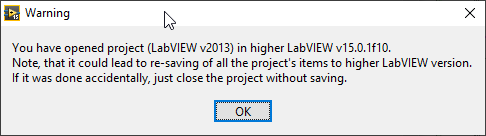

# LabVIEW Project Version Check toolkit

Have you ever had a situation, when some old project was accidentally opened in newer LabVIEW, and resaved to that newer version?
Of course, if you use software version control like git or SVN - then it is not a problem, you could simply reset your working branch to previous state. But what if meanwhile you've implemented some changes, and after that re-saved all the project? It's a pity, because after rollback all those changes should be implemented again. And in case when project is stored outside git or SVN repository, then the situation is even worth...

So if you had such a situation at least once, then I believe this small tool will be useful for you.

## What it does:

When LabVIEW project is opened, this tool checks version of the project. If it is implemented in lower LabVIEW version than the active one (by active I mean LabVIEW version in which you open a project) - then you'll recieve warning window about it. After that, you could close project and do not save it. Or if you've opened project in newer LabVIEW version intentionally, you could continue working with the code, and then save it as you wish.

## What it does not:

It does not check versions of opened LabVIEW VIs, libraries, classes, etc. Main reason - it will be not practical at all. Many reusable libraries/toolkits are implemented in the lowest possible/useful LabVIEW version, so then they are mass-compiled when added to the actual code. And it would be quite bothering to see every time some warning window while opening such VIs.

